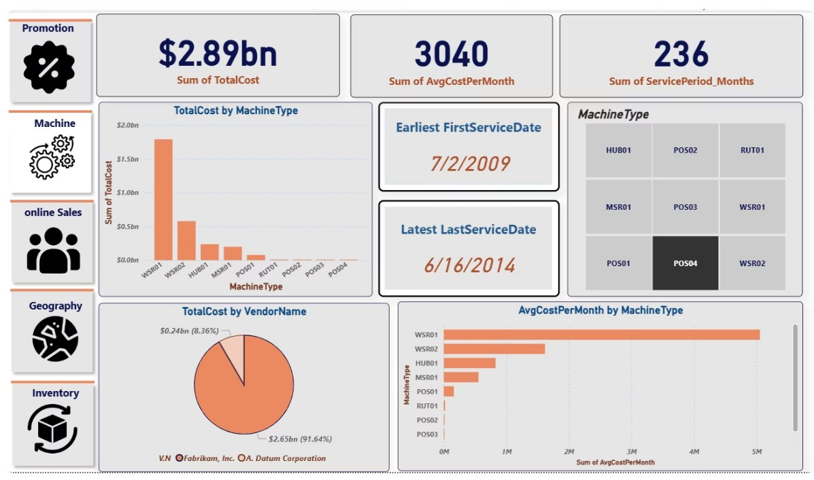
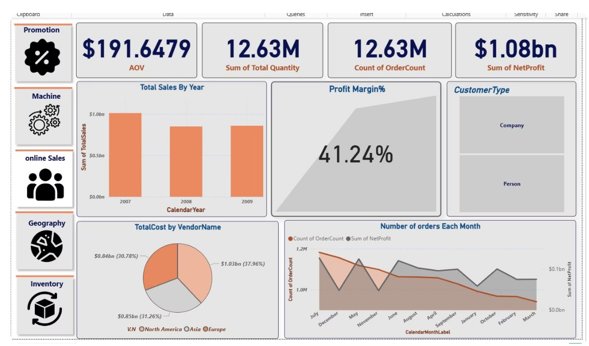
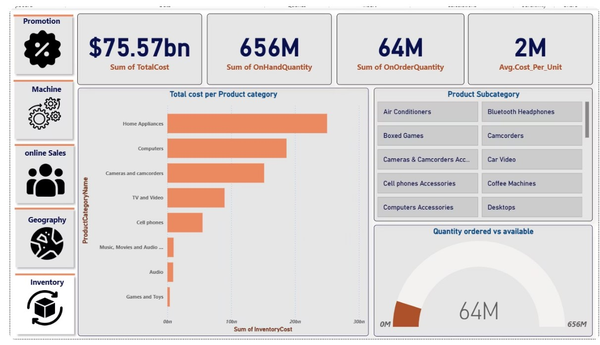
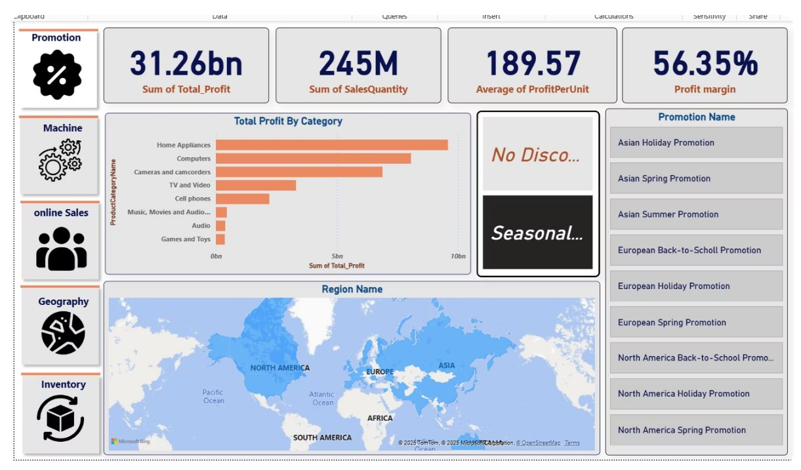
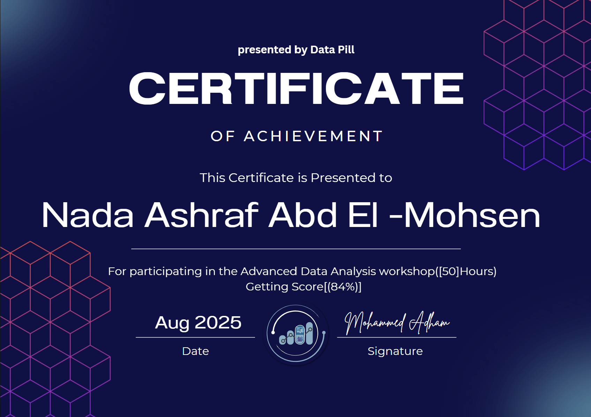

# Let's create a README.md file with the content we generated for Nada's project

"""# 📊 End-to-End Retail Data Analytics Project  

## 📌 Overview  
This project is a **team-based data analytics solution** designed to analyze a retail dataset across multiple business areas:  
- **Machine Performance**  
- **Promotion Effectiveness**  
- **Inventory Status**  
- **Geography Sales**  
- **Online Sales**  

We implemented a complete pipeline using **SSIS for ETL**, **SQL Server for data modeling and KPI calculation**, and **Power BI for interactive dashboards**. The goal was to provide business insights that support **decision-making in sales, marketing, and operations**.  

---

## 🛠️ Tools & Technologies  
- **SQL Server** – Data modeling, KPI calculations, performance optimization  
- **SSIS (SQL Server Integration Services)** – ETL pipelines (Extract, Transform, Load)  
- **Power BI** – Interactive dashboards and visualization  
- **Team Collaboration** – Task division, version control, documentation  

---

## 🔄 Project Workflow  
### 1. Data Integration (SSIS)  
- Extracted data from multiple sources  
- Applied transformations (Lookups, Aggregations, Data Cleansing)  
- Loaded curated datasets into SQL Server  

### 2. Data Modeling & Analysis (SQL)  
- Created **fact and dimension tables** in a star-schema style  
- Built calculated columns & KPIs, e.g.  
  - `ServicePeriod_Months`, `AvgCostPerMonth` (Machine Performance)  
  - `SalePerUnit`, `ProfitPerUnit`, `Total_Profit` (Promotions)  
  - `AvgCost_Per_Unit` (Inventory)  
  - `NetRevenue`, `NetProfit`, `AOV` (Online Sales)  

### 3. Visualization (Power BI)  
- Designed dashboards for each domain  
- Implemented drill-through filters, slicers, and dynamic KPIs  
- Delivered actionable insights for business users  

---

## 📈 Key Insights  
- 📌 **Sales Trends**: Seasonal peaks highlighted opportunities for targeted campaigns  
- 📌 **Customer Insights**: Top 10% of customers generated the majority of revenue  
- 📌 **Promotion Effectiveness**: Profit per unit varied significantly across regions and product categories  
- 📌 **Inventory**: High on-hand stock in certain categories indicated risk of overstocking  
- 📌 **Machine Performance**: Service costs per month varied by vendor, guiding cost optimization  

---

- **As a team:**  
  - Designed SSIS ETL pipelines for 5 domains  
  - Built SQL queries and KPIs for analytics  
  - Created Power BI dashboards with interactive features  

---

## 📷 Sample Dashboards  

Example:  
  
  
  
  

---

## 📢 Project Link  

🔗 [View Project on Maven](#) *(https://mavenshowcase.com/project/42889)*  

---

## 🏆 Certificate  

This project was completed as part of the **Advanced Data Analysis Workshop (50 hours)** by **Data Pill**, where I achieved a score of **84%**.  

  
